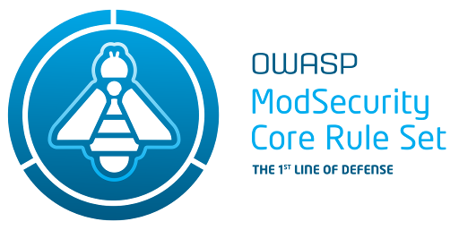

# Traefik Modsecurity Plugin

This is a fork of the original <https://github.com/madebymode/traefik-modsecurity-plugin>.

This fork introduces three transport-level knobs—`dialTimeoutMillis`, `idleConnTimeoutMillis` and
`maxIdleConnsPerHost`—that let you keep Traefik’s **goroutine count** and the node’s **conn-track
table** under control when your cluster serves thousands of back-ends.  
In short, they allow you to:

* **Fail fast** if the ModSecurity service is unreachable (`dialTimeoutMillis`).
* **Prune** idle keep-alive sockets sooner (`idleConnTimeoutMillis`).
* **Cap** the number of idle sockets Traefik keeps per host (`maxIdleConnsPerHost`).

see:  https://github.com/traefik/plugindemo#troubleshooting

----

Traefik plugin to proxy requests to [owasp/modsecurity-crs](https://hub.docker.com/r/owasp/modsecurity-crs):apache

- [Traefik Modsecurity Plugin](#traefik-modsecurity-plugin)
    - [Demo](#demo)
    - [Usage (docker-compose.yml)](#usage-docker-composeyml)
    - [How it works](#how-it-works)
    - [Local development (docker-compose.local.yml)](#local-development-docker-composelocalyml)

## Demo

Demo with WAF intercepting relative access in query param.

## Usage (docker-compose.yml)

See [docker-compose.yml](docker-compose.yml)

1. docker-compose up
2. Go to http://localhost/website, the request is received without warnings
3. Go to http://localhost/website?test=../etc, the request is intercepted and returned with 403 Forbidden by
   owasp/modsecurity
4. You can you bypass the WAF and check attacks at http://localhost/bypass?test=../etc

## How it works

This is a very simple plugin that proxies the query to the owasp/modsecurity apache container.

The plugin checks that the response from the waf container hasn't an http code > 400 before forwarding the request to
the real service.

If it is > 400, then the error page is returned instead.

The *dummy* service is created so the waf container forward the request to a service and respond with 200 OK all the
time.

## Configuration

| Key | Required? | Default | What it does |
|-----|-----------|---------|--------------|
| **`modSecurityUrl`** | **yes** | — | URL of the OWASP / ModSecurity service (e.g. `http://modsecurity-crs.modsecurity-crs.svc:8080`). |
| `timeoutMillis` | no | **2000 ms** | *Whole* request budget (dial + request + response). |
| `dialTimeoutMillis` | no | **30000 ms** | Time limit for **establishing the TCP connection** to the ModSecurity service. If the socket isn’t connected within this window, the plugin aborts with `Bad Gateway`. |
| `idleConnTimeoutMillis` | no | **90000 ms** | **How long an idle keep-alive socket can stay open** before it is closed and its goroutine reclaimed. Lowering this prevents a slow leak of goroutines under spiky traffic. |
| `maxIdleConnsPerHost` | no | **2** | Upper bound on the **number of idle sockets** the plugin keeps for `modSecurityUrl`. Set higher for very high-RPS environments, lower to conserve file descriptors / conn-track slots. |
| `jailEnabled` | no | `false` | Enables 429 “jail” for repeat offenders. |
| `jailTimeDurationSecs` | no | `3600` | How long a client IP stays in jail (seconds). |
| `badRequestsThresholdCount` | no | `25` | Number of 403 replies that trips the jail. |
| `badRequestsThresholdPeriodSecs` | no | `600` | Sliding-window length (seconds) for the above threshold. |
| `unhealthyWafBackOffPeriodSecs` | no | `0` | the period, in seconds, to backoff if calls to modsecurity fail. Default to 0. Default behavior is to send a 502 Bad Gateway when there are problems communicating with modsec. |

> **Tip:** leave a field out (or set it to `0`) to use the default shown in the table.

## Local development (docker-compose.local.yml)

See [docker-compose.local.yml](docker-compose.local.yml)

`docker-compose -f docker-compose.local.yml up` to load the local plugin
